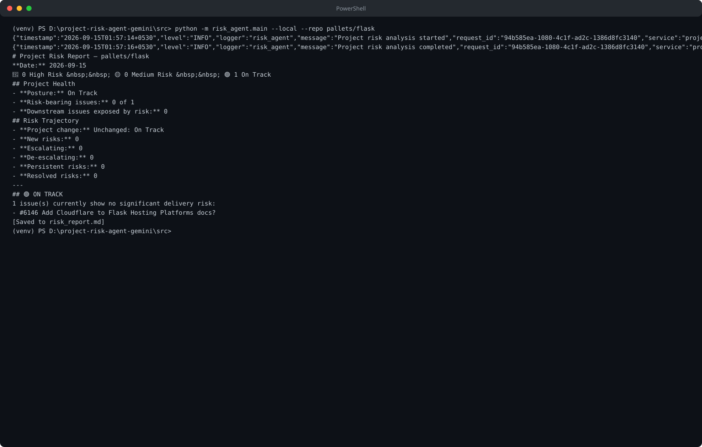
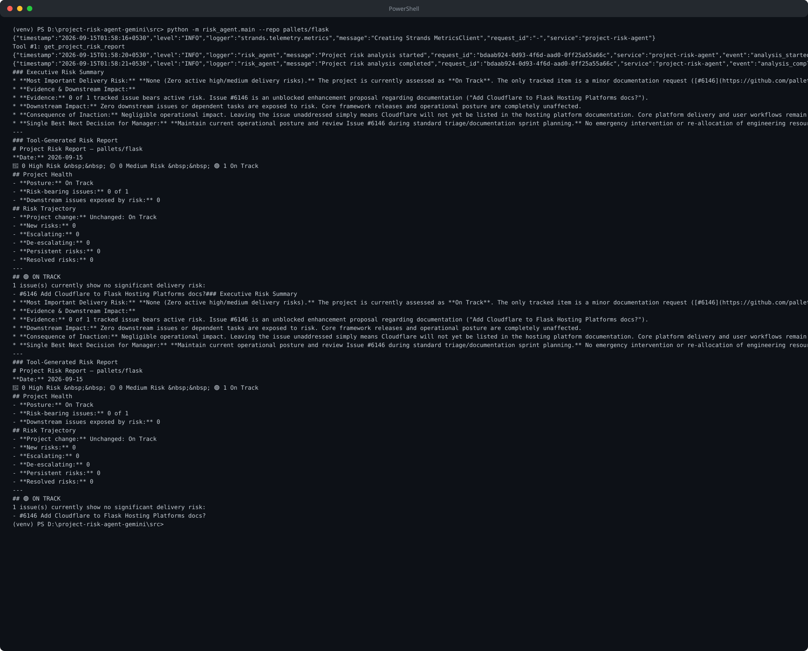

# Project Risk Agent

Project Risk Agent analyzes authorized GitHub repositories and turns open issue
data into an explainable delivery-risk report. It helps engineering managers,
tech leads, and delivery teams find bottlenecks before a delayed task cascades
into missed milestones.

**Built by [Khilankumar Rajput](https://github.com/iamkk369)** for the AWS Agents for Humans Hackathon 2026 — Professional Agents track.

The product is read-only: it fetches GitHub issues, evaluates risk, and
recommends decisions. It does not modify issues or reassign work.

## What it does

- Fetches all open GitHub issues with pagination and excludes pull requests.
- Parses due dates plus `blocks #N` and `blocked by #N` relationships.
- Scores issues with deterministic, auditable rules rather than opaque ML.
- Propagates dependency risk through direct and transitive downstream impact.
- Produces project posture, bottleneck, affected-issue, and dependency-chain summaries.
- Adds decision support with evidence, consequence of inaction, and a next step.
- Compares the current report with bounded local history to show trajectory.
- Analyzes one repository or an independent portfolio of repositories.
- Supports signed GitHub webhooks for event-driven re-analysis.
- Emits structured logs and supports environment variables or AWS Secrets Manager.

## Architecture

Project Risk Agent separates deterministic project-risk analysis from AI-assisted executive explanation. The diagram shows the primary end-to-end path and the optional event, runtime, and persistence integrations.

```mermaid
flowchart LR
    GI[GitHub Issues] --> GT[GitHub Tool\nFetch + parse due dates/dependencies]
    GT --> RE[Risk Engine\nScoring + dependency graph]
    RE --> HI[History\nTrajectory comparison]
    HI --> DS[Decision Support\nPriority, impact, consequence, next decision]
    DS --> SA[Strands Agent\nTool call: risk report pipeline]
    SA --> GG[Google Gemini\nExecutive reasoning]
    GG --> FR[Final Markdown Report]

    WH[GitHub Webhook\nSigned event] -. optional, not deployed .-> EH[Webhook/Event Handler]
    EH -. triggers fresh analysis .-> GT
    AC[Amazon Bedrock\nAgentCore Runtime] -. optional, not deployed .-> SA
    FR -. optional, not deployed .-> S3[Amazon S3\nEncrypted report persistence]

    classDef primary fill:#1f2937,stroke:#60a5fa,color:#fff;
    classDef optional fill:#374151,stroke:#9ca3af,color:#fff,stroke-dasharray: 5 5;
    class GI,GT,RE,HI,DS,SA,GG,FR primary;
    class WH,EH,AC,S3 optional;
```



### How it works

1. **GitHub Issues** — The agent reads open issues from the selected authorized repository through the GitHub REST API. Pull requests returned by GitHub’s issues endpoint are excluded.
2. **GitHub Tool** — `github_tool.py` paginates the API results, extracts due dates, and parses `blocks`, `blocked by`, and `depends on` relationships from issue bodies.
3. **Risk Engine** — `risk_engine.py` applies deterministic High, Medium, and Low rules, builds a normalized dependency graph, calculates direct and transitive downstream impact, and propagates upstream risk.
4. **History** — `history.py` compares the current project snapshot with bounded local history to identify new, escalating, persistent, de-escalating, and resolved risks.
5. **Decision Support** — `decision_support.py` ranks risky issues and adds urgency, impact, consequence-of-inaction, and recommended-decision signals for managers.
6. **Strands Agent** — The Strands agent calls the report pipeline as a tool, keeping deterministic findings separate from natural-language reasoning.
7. **Google Gemini** — Gemini turns the tool output into an executive explanation covering the highest-priority risk, evidence, downstream impact, consequence of inaction, and best next decision.
8. **Final Markdown Report** — The system produces a prioritized Markdown report containing project posture, bottleneck analysis, trajectory, decision focus, and issue-level findings.
9. **Optional integrations** — Signed GitHub webhooks can trigger a fresh analysis, AgentCore can host the Strands entrypoint, and S3 can persist encrypted reports. These paths are implemented as supported integrations but are not deployed or live-verified in AWS.

Risk levels are based on overdue status, dependency exposure, urgency, and
propagated upstream risk:

| Level | Meaning |
| --- | --- |
| High | Overdue work with downstream impact, or equivalent propagated risk |
| Medium | Isolated overdue work, meaningful downstream exposure, or an urgent blocker |
| Low | On track with no meaningful dependency risk |

## Single-project and portfolio modes

Set `GITHUB_REPO=owner/repository` for the default target, or provide an
explicit repository to the agent-backed CLI:

```bash
python -m src.risk_agent.main --local --repo owner/repository
python -m src.risk_agent.main --repo owner/repository
```

For independent portfolio analysis, set `PROJECT_REPOS` to a comma-separated
list and run:

```bash
python -m src.risk_agent.main --portfolio
```

Issue numbers and history remain scoped to each repository.

## Event-driven execution

The local webhook listener verifies GitHub's HMAC SHA-256 signature, accepts
issue, push, and pull-request change events for the configured repository, and
starts a fresh analysis in the background:

```bash
python -m src.risk_agent.main --webhook
```

The listener exposes `POST /webhook/github` and `GET /healthz`.

## AgentCore and S3

`src/risk_agent/agentcore_app.py` is an optional Amazon Bedrock AgentCore
Runtime entrypoint for the same Strands + Gemini workflow. It accepts an
optional `repository` invocation field and is AgentCore-compatible for future
AWS deployment, but this repository does not claim that it has been deployed
or verified in AWS.

When `S3_REPORT_BUCKET` is configured in a running AWS environment, the
code path supports persisting encrypted Markdown objects under
`S3_REPORT_PREFIX/<owner-repository>/`. S3 support is implemented, but no
AWS deployment or live verification is claimed.

See [`deploy/AGENTCORE.md`](./deploy/AGENTCORE.md) and
[`deploy/SECURITY.md`](./deploy/SECURITY.md) for deployment and credential
guidance.

## Local setup

```bash
git clone <repository-url>
cd <repository-directory>
python -m venv venv
venv\Scripts\activate        # Windows
# source venv/bin/activate   # macOS/Linux
pip install -r requirements.txt
```

Copy `config/env.example` to `.env` and set:

```text
GITHUB_TOKEN=your_github_token
GITHUB_REPO=owner/repository
GEMINI_API_KEY=your_gemini_api_key
```

The token must be authorized to read issues in the selected repositories.
`GEMINI_API_KEY` is required only for the Strands/Gemini run; `--local` runs
the deterministic pipeline without it. Optional settings cover webhooks,
history, logging, Secrets Manager, portfolio mode, and S3.

## Testing

```bash
python -m pytest -q
python -m compileall src tests
git diff --check
```

## Real-World Testing

### Local Execution

**Repository:** `pallets/flask`

**Execution:**

```bash
python -m risk_agent.main --local --repo pallets/flask
```

**Actual result:**

- Successfully analyzed the real public GitHub repository
- 1 issue analyzed
- 0 High Risk
- 0 Medium Risk
- 1 On Track
- Project Health: On Track
- Risk Trajectory: Unchanged: On Track



### Strands + Gemini Execution

**Repository:** `pallets/flask`

**Execution:**

```bash
python -m risk_agent.main --repo pallets/flask
```

**Actual result:**

- Successfully analyzed the real public GitHub repository
- 1 issue analyzed
- 0 High Risk
- 0 Medium Risk
- 1 On Track
- Project Health: On Track
- Gemini generated the Executive Risk Summary and recommended manager decision



### Current Limitation

The current GitHub ingestion implementation is intended for smaller repositories. During testing, a large repository such as `microsoft/vscode` failed with HTTP 422 because the current page-based pagination approach is not supported by GitHub for large datasets. Since this was developed as a hackathon-focused project, large-scale repository ingestion is currently outside the scope.

## Project structure

```text
project-risk-agent/
├── .gitignore                         # Excludes secrets, caches, and generated artifacts
├── LICENSE                            # Defines the MIT license terms
├── README.md                          # Documents the project, setup, and capabilities
├── requirements.txt                   # Lists local runtime dependencies
├── requirements-agentcore.txt         # Lists optional AgentCore runtime dependencies
├── pytest.ini                         # Configures pytest import paths
├── config/
│   └── env.example                    # Provides local environment variable template
├── deploy/
│   ├── AGENTCORE.md                   # Documents optional AgentCore deployment workflow
│   ├── SECURITY.md                    # Documents credentials, IAM, and webhook security
│   ├── agentcore.env.example          # Provides AgentCore runtime configuration template
│   └── iam-policy.json                # Provides narrow Secrets Manager IAM example
├── docs/
│   └── architecture.md               # Explains system architecture and design boundaries
├── src/
│   └── risk_agent/
│       ├── __init__.py                # Marks risk_agent as a Python package
│       ├── main.py                    # Provides CLI modes and pipeline orchestration
│       ├── agentcore_app.py           # Exposes the optional AgentCore runtime entrypoint
│       ├── github_tool.py             # Fetches issues and parses dependencies
│       ├── risk_engine.py             # Scores risks and builds dependency graphs
│       ├── report.py                  # Renders analyzed risks as Markdown
│       ├── history.py                 # Stores and compares risk snapshots
│       ├── decision_support.py        # Adds prioritized manager decision signals
│       ├── portfolio.py               # Analyzes and summarizes multiple repositories
│       ├── webhook.py                 # Serves signed GitHub webhook requests
│       ├── event_handler.py           # Validates webhook events and repositories
│       ├── observability.py           # Emits structured logs and request IDs
│       ├── security.py                # Resolves environment or AWS credentials
│       └── storage.py                 # Optionally persists reports to S3
└── tests/
    └── test_risk_agent.py             # Tests fetching, scoring, reporting, and integrations
```

The controlled payment-gateway repository `iamkk369/risk-agent-demo` is
retained only as a reproducible example/test data source. Project Risk Agent
itself is repository-agnostic.

## Author

**Khilankumar Rajput**  
GitHub: [@iamkk369](https://github.com/iamkk369)

Built for the AWS Agents for Humans Hackathon 2026.

## License

MIT
