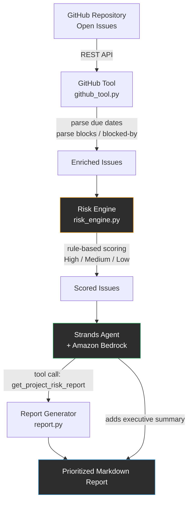
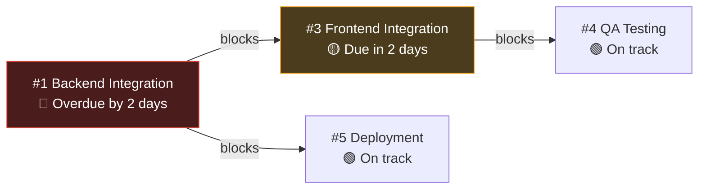

# Architecture — Project Risk Agent

## System Flow

## Why This Design

**Single agent, not multi-agent.** The reasoning task here — "does this delay matter, and why" — doesn't need multiple specialized agents negotiating with each other. One Strands agent with well-defined tools is easier to build, debug, and demonstrate reliably within the hackathon timeline, and it's less likely to fail live during a demo.

**Deterministic risk scoring, not ML.** Risk levels come from explicit, explainable rules (overdue + blocks others → High, etc.), not a trained model. This makes every score auditable — a manager can see exactly why an issue was flagged, which builds trust in the agent's output.

**Strands wraps the pipeline as a tool, then reasons on top of it.** The agent doesn't re-implement the fetching/scoring logic itself — it calls `get_project_risk_report()` as a tool and then adds a short executive summary for a human reader. This is where Strands actually adds value beyond a plain script: the agent decides how to present findings to different audiences, not just what the findings are.

**Human-in-the-loop.** The agent analyzes and recommends — it does not automatically reassign issues, change deadlines, or post to Slack. A human always makes the final call. This keeps the system safe to demo and simple to reason about.

## Dependency Cascade Example

The demo repository is seeded so the agent has to reason through a real cascade:

The agent correctly identifies that #1 being overdue is the root cause putting the whole payment-migration chain at risk — not just a standalone late task.

## Data Flow Detail

1. **Fetch** — `github_tool.fetch_open_issues()` calls the GitHub REST API for all open issues in the configured repo (PRs are filtered out).
2. **Parse** — Each issue body is scanned for `Due: YYYY-MM-DD`, `blocks #N`, and `blocked by #N` patterns using regex. This is a deliberate MVP shortcut: it works reliably against a controlled demo repo without needing GitHub's more complex Projects/dependency APIs.
3. **Score** — `risk_engine.calculate_risk()` applies the rule table (see README) to every issue, using a lookup of all issues by number to resolve what each issue blocks.
4. **Report** — `report.generate_report()` groups issues into High / Medium / Low sections, each with the due date, a plain-English reason, and a recommended next step.
5. **Agent layer** — `main.run_with_agent()` exposes the whole pipeline as a single Strands `@tool`, then asks the agent (running on Amazon Bedrock, Claude) to call it and add a short executive summary before the full report.

## Future Directions (Out of Scope for MVP)

- Native GitHub Projects dependency graph instead of regex-based `blocks #N` parsing
- Transitive risk propagation (if issue A is blocked by an overdue issue, A should inherit some risk even if A itself isn't overdue)
- Multi-source input (Jira, Linear) alongside GitHub
- Slack/email delivery of the report
- Human-approved automated actions (e.g., agent drafts a Slack message, human approves and sends)
- Deployment via Amazon Bedrock AgentCore
