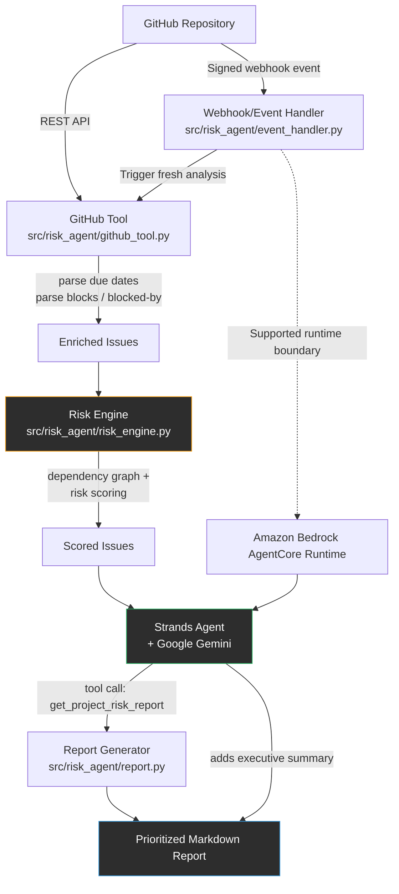
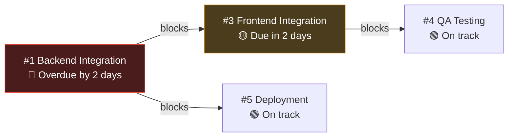

# Architecture — Project Risk Agent

## System Flow

## Why This Design

**Single agent, not multi-agent.** The reasoning task here — "does this delay matter, and why" — does not need multiple specialized agents negotiating with each other. One Strands agent with well-defined tools is easier to build, debug, and operate reliably.

**Deterministic risk scoring, not ML.** Risk levels come from explicit, explainable rules (overdue + blocks others → High, etc.), not a trained model. This makes every score auditable — a manager can see exactly why an issue was flagged, which builds trust in the agent's output.

**Strands wraps the pipeline as a tool, then reasons on top of it.** The agent doesn't re-implement the fetching/scoring logic itself — it calls `get_project_risk_report()` as a tool and then adds a short executive summary for a human reader. This is where Strands actually adds value beyond a plain script: the agent decides how to present findings to different audiences, not just what the findings are.

**Human-in-the-loop.** The agent analyzes and recommends — it does not automatically reassign issues, change deadlines, or post to Slack. A human always makes the final call. This keeps the system safe to operate and simple to reason about.

## Dependency Cascade Example

The controlled example repository is seeded so the agent has to reason through a real cascade:

The agent correctly identifies that #1 being overdue is the root cause putting the whole payment-migration chain at risk — not just a standalone late task.

## Data Flow Detail

1. **Fetch** — `src/risk_agent/github_tool.py` calls the GitHub REST API for all open issues in the selected repository (PRs are filtered out).
2. **Parse** — Each issue body is scanned for `Due: YYYY-MM-DD`, `blocks #N`, and `blocked by #N` patterns using regex. This keeps the integration portable across authorized GitHub repositories without requiring GitHub Projects APIs.
3. **Score** — `src/risk_agent/risk_engine.py` applies the rule table (see README) to every issue, using a lookup of all issues by number to resolve what each issue blocks.
4. **Report** — `report.generate_report()` groups issues into High / Medium / Low sections, each with the due date, a plain-English reason, and a recommended next step.
5. **Project intelligence** — `risk_engine.summarize_project_risk()` aggregates issue-level results into project posture, risk-bearing issue count, downstream exposure, and the primary bottleneck.
6. **Report** — `report.generate_report()` surfaces the project-level health summary before the detailed High / Medium / On Track sections.
7. **Agent layer** — `main.run_with_agent()` exposes the whole pipeline as a single Strands `@tool`, then asks the agent (running on Google Gemini) to call it and add decision-support reasoning before the full report.
8. **Event-driven trigger** — `event_handler.py` validates supported GitHub repository events and `webhook.py` verifies GitHub's HMAC SHA-256 signature, acknowledges valid events quickly, and triggers a fresh analysis in a background worker. The worker re-fetches GitHub state instead of treating the webhook payload as the authoritative project snapshot.
9. **AgentCore runtime** — `agentcore_app.py` exposes the existing Strands + Gemini agent through the AgentCore-compatible runtime boundary. AgentCore is a supported runtime option, not a deployed AWS runtime in this repository; the deterministic risk pipeline remains provider-neutral and is not rewritten around AWS-specific logic.

## Current Dependency Intelligence

The risk engine normalizes both `blocks` and `blocked by` relationships into a directed dependency graph. It calculates direct/transitive downstream impact, dependency-chain depth, and upstream blockers before applying risk rules. The strongest upstream risk is propagated through the graph, so a root bottleneck can affect downstream work even when the downstream issue itself is not overdue.

## Current Project Intelligence

The risk engine now reasons over a normalized dependency graph rather than only direct `blocks` lists. It accepts both `blocks #N` and `blocked by #N` expressions, calculates transitive downstream exposure and dependency-chain depth, propagates the strongest upstream risk through the graph, and derives a project-level posture and primary bottleneck.

## AgentCore Runtime Support

`src/risk_agent/agentcore_app.py` provides an optional Amazon Bedrock AgentCore Runtime adapter for local configuration and future deployment. It accepts an invocation payload, including an optional repository, runs the same Strands agent and `get_project_risk_report` tool used locally, and returns the agent response. AgentCore is a supported runtime boundary; Gemini remains the model provider. The repository does not claim any AWS deployment or live verification.

The repository includes `deploy/AGENTCORE.md` with the supported AgentCore configuration and deployment procedure for any environment that later provisions AWS resources. CodeZip is preferred for this time-constrained project because it avoids requiring Docker.

The supported boundary is intentionally limited to AgentCore Runtime. Lambda, Fargate, RDS, Redis, and API Gateway are not added merely for service count. Local history remains the default; S3 report persistence is an optional capability implemented in `src/risk_agent/storage.py` and is not claimed as deployed in AWS.

## Event-Driven Execution

The current implementation includes a dependency-light local webhook listener as the event-driven boundary. Supported repository changes include issue updates, pushes, and pull-request changes. Only signed events for the configured repository can trigger analysis. The event handler is separated from the HTTP transport so the same semantic trigger can be reused by a future AWS runtime without changing the risk engine.

## Future Directions

- Native GitHub Projects dependency graph instead of regex-based `blocks #N` parsing
- Multi-source input (Jira, Linear) alongside GitHub
- Slack/email delivery of the report
- Human-approved automated actions (e.g., agent drafts a Slack message, human approves and sends)
- Durable history backends beyond the current local file and S3 persistence support, which remain optional and not yet deployed in AWS

## Portfolio analysis

The optional portfolio layer reuses the same per-repository risk analysis for multiple GitHub repositories. Each repository remains an independent analysis boundary; only project-level summaries are aggregated. Portfolio posture is Critical when any project is Critical, otherwise Watch when any project is Watch, otherwise On Track. Priority projects are ranked using posture, High-risk count, downstream exposure, and bottleneck impact.
